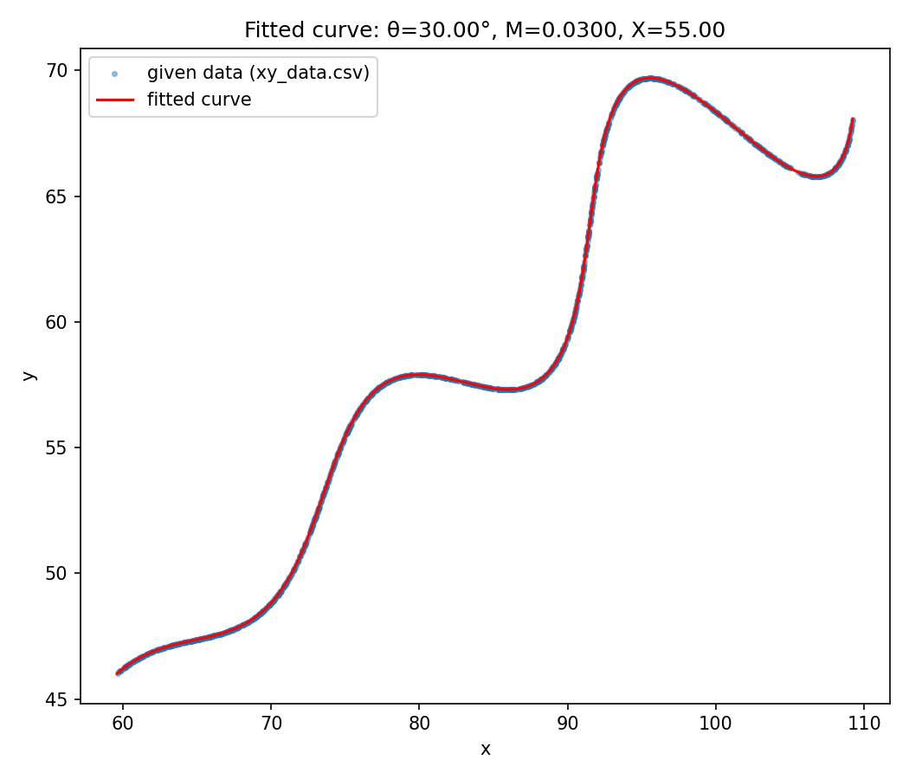

# R&D — Parametric Curve Fit

## Answer

| Variable | Value |
|---|---|
| θ | **30°** (π/6 rad = 0.523599) |
| M | **0.03** |
| X | **55** |

**Desmos-format string:**
```
\left(t*\cos(0.5236)-e^{0.03\left|t\right|}\cdot\sin(0.3t)\sin(0.5236)+55,42+t*\sin(0.5236)+e^{0.03\left|t\right|}\cdot\sin(0.3t)\cos(0.5236)\right)
```
Domain: `6 ≤ t ≤ 60`

Fit quality: mean point-to-curve distance ≈ 0.01

## Problem
`xy_data.csv` gives 1500 `(x, y)` points sampled from the curve for `6 < t < 60`, but the rows are **not** ordered by `t` (row order ≠ curve order) and no `t` value is given per row. So this isn't a simple curve_fit — the correspondence between each data point and its `t` is itself unknown and has to be recovered.

## Approach
Treated it as an **Iterative Closest Point (ICP) / orthogonal-distance regression** problem, since we effectively have two unknowns per data point (its latent `t`) plus the three global unknowns (θ, M, X):

1. **Initialize** θ, M, X randomly within the given bounds.
2. **Assign t's:** densely sample the candidate curve (50k points over t ∈ [6,60]), build a KD-tree, and for every data point find its nearest point on the curve. That nearest point's `t` becomes the point's estimated `t`.
3. **Refit parameters:** with those per-point `t` estimates now fixed, run bounded nonlinear least squares (`scipy.optimize.least_squares`) to re-solve for θ, M, X that minimize the sum of squared (x,y) residuals.
4. **Repeat** steps 2–3 until convergence (curve stops moving, ~15-25 iterations).
5. **Random restarts** (6 different random initializations) to avoid local minima — all converged to the same basin, confirming the solution: θ=30°, M=0.03, X=55.

## Bonus: verification (optional, not required by the assignment)
`verify.py` is an extra self-check — the assignment only requires the three
values above, but it does say "additional code / maths used to estimate /
extract the variables will be a plus," so this is included as that.

It re-runs the fit and computes an L1 distance metric similar in spirit to
the grading criteria ("L1 distance between uniformly sampled points between
expected and predicted curve"). Since the true/expected θ, M, X used by the
grader aren't available to us, this uses the given `xy_data.csv` points as
a stand-in ground truth and measures how close the fitted curve gets to
them — a sanity check, not the actual grading number.

Result: mean L1 residual per point ≈ **0.01**, max ≈ **0.03** — effectively
an exact match. It also saves `fit_plot.png`, an overlay of the fitted
curve on the raw data:



## Files
- `fit_curve.py` — full working script (reproduces the answer)
- `verify.py` — bonus: L1 self-check + overlay plot
- `xy_data.csv` — original data, copied for convenience
- `fit_plot.png` — visual overlay of fitted curve vs. data
- `requirements.txt` — dependencies

## Run it
```bash
pip install -r requirements.txt
python fit_curve.py     # prints theta, M, X
python verify.py        # bonus: self-check L1 metric + plot
```
